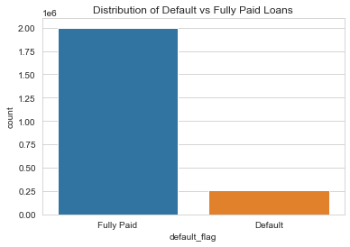
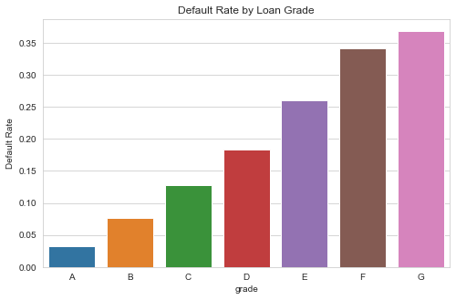
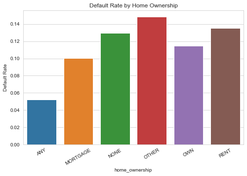
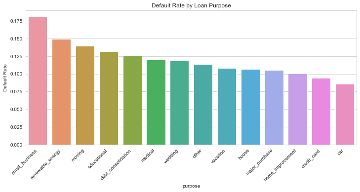
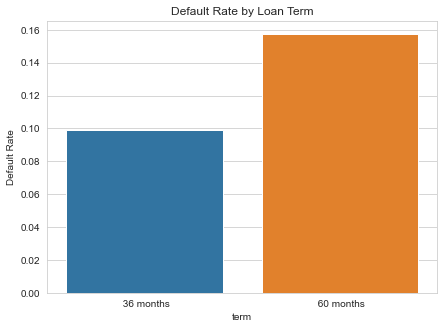
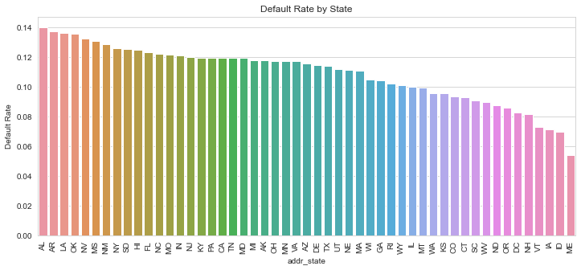
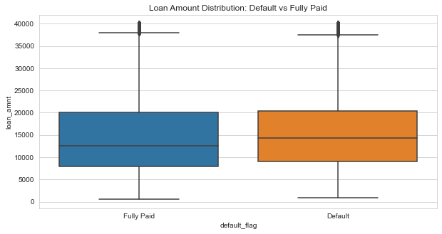
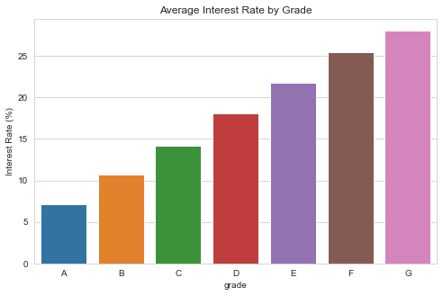

# Credit Risk & Loan Default Analysis

**Technologies:** Python, Pandas, NumPy, Matplotlib, Seaborn, SQL  

This project focuses on analyzing loan application data to evaluate borrower credit risk, loan default behavior, and portfolio exposure. Leveraging Python and SQL, it identifies high-risk borrower segments, examines key drivers of defaults, and provides actionable insights to optimize credit risk modeling, underwriting strategies, and portfolio management decisions.

---

## Project Overview

Credit risk is a critical component of financial portfolio management. This project analyzes historical loan data to:

- Identify high-risk borrower segments based on demographics, credit grades, loan purpose, state, and home ownership.  
- Quantify risk exposure by assessing default probabilities, interest rate sensitivity, and loan amount distributions.  
- Deliver actionable insights for credit risk modeling, underwriting decisions, and portfolio monitoring.

The analysis uses a combination of **Python for data processing and visualization** and **SQL for querying, aggregating, and filtering loan-level data efficiently**. Cohort-based analysis and segmentation allow deep understanding of borrower behavior.

---

## Methodology

1. **Data Preparation & Cleaning**
   - Loaded and cleaned the dataset containing loan-level attributes and borrower information.  
   - Created a **binary `default_flag`** based on loan status to classify loans as defaulted (Charged Off / Default) or fully paid.  

2. **Exploratory Data Analysis (EDA)**
   - **Default Distribution:** Count and proportion of defaulted vs fully paid loans to understand baseline risk.  
   - **Segment Analysis:** Default rates calculated for key borrower segments using `groupby` and mean aggregation:  
     - **Home Ownership**  
     - **Loan Purpose**  
     - **Borrower State**  
     - **Loan Grade**  
     - **Loan Term**  
   - **Interest Rate & Loan Amount Analysis:**  
     - Average interest rates by grade.  
     - Loan amount distributions for defaulted vs fully paid loans.  
   - **SQL-Based Analysis:** Extracted, filtered, and aggregated loan-level data for efficient evaluation of portfolio exposure and risk concentration.  

3. **Visualization**
   - Bar plots for default rate by grade, purpose, term, home ownership, and state.  
   - Box plots for loan amount distributions comparing defaulted vs fully paid loans.  
   - Combined segmentation and visualization to identify high-risk cohorts clearly.  

---

## Key Insights

- **High-Risk Loan Purposes & States:** Certain loan purposes (e.g., debt consolidation, small business loans) and specific states show elevated default rates.  
- **Credit Grade Sensitivity:** Borrowers with lower credit grades (D, E, F, G) are more likely to default.  
- **Interest Rate Correlation:** Higher interest rates are positively correlated with increased probability of default.  
- **Home Ownership Impact:** Borrowers with rent or other non-owned home arrangements show higher default risk.  
- **Loan Amount Distribution:** Defaulted loans exhibit distinct distribution patterns compared to fully paid loans, providing insights for pricing and underwriting policies.  

These insights support **risk-based segmentation**, improved credit scoring, and targeted portfolio management strategies.

---

## Visualizations

- **Default Distribution:**   
- **Default Rate by Loan Grade:**   
- **Default Rate by Home Ownership:**   
- **Default Rate by Loan Purpose:**   
- **Default Rate by Loan Term:**   
- **Default Rate by State:**   
- **Loan Amount Distribution by Default:**   
- **Average Interest Rate by Grade:**   

---

## Skills & Techniques

- **Data Analysis & Visualization:** Pandas, Matplotlib, Seaborn, cohort analysis.  
- **SQL:** Advanced querying, aggregation, filtering, portfolio segmentation.  
- **Risk Analytics:** Default modeling, segment-level risk assessment, exposure measurement.  
- **Reporting & Communication:** Executive-ready dashboards, clear visual storytelling, actionable insights.

---

## Business Impact

- Identifies **high-risk borrower segments and loan portfolios**, improving risk management practices.  
- Supports **credit risk modeling, underwriting policy refinement, and portfolio optimization**.  
- Provides **data-driven recommendations** for pricing, loan approval strategies, and exposure monitoring.  
- Helps financial institutions **reduce losses and enhance decision-making** through predictive insights.

---

## Use Case & Target Roles

This project demonstrates expertise in **credit risk analytics, financial data science, and portfolio management**, making it highly relevant for roles such as:

- Risk Analyst  
- Credit Risk Analyst  
- Financial Data Scientist  
- Portfolio Manager  
- Credit Underwriting Analyst  

---

## Author

**Het Patel**  
Big Data & AI Analyst | Python, SQL, Power BI, Tableau  
Barrie, ON | het376255@gmail.com | +1 (249) 535 5730  
[LinkedIn](https://www.linkedin.com/in/het-patel-359184246/) | [GitHub](https://github.com/HetPatel2022)
